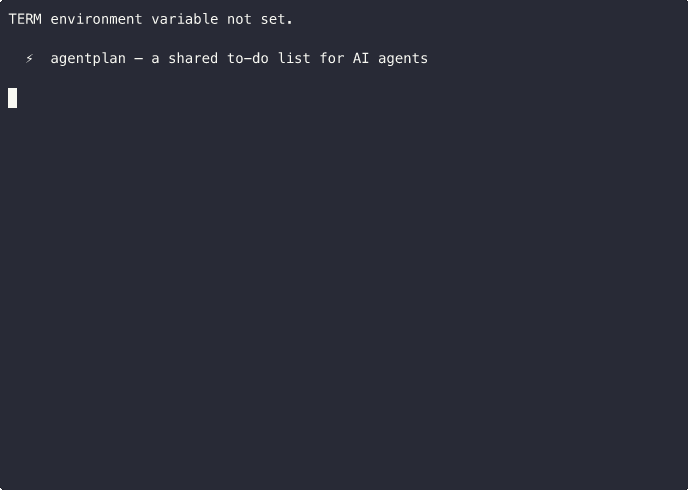

<p align="center">
  <h1 align="center">agentplan</h1>
  <p align="center"><strong>A shared to-do list for AI agents.</strong></p>
</p>

<p align="center">
  <a href="https://pypi.org/project/agentplan/"></a>
  <a href="https://pypi.org/project/agentplan/"></a>
  <a href="https://pepy.tech/projects/agentplan"></a>
  <a href="https://github.com/fraction12/agentplan/actions/workflows/ci.yml"></a>
  <a href="https://github.com/fraction12/agentplan/actions/workflows/codeql.yml"></a>
  <a href="https://securityscorecards.dev/viewer/?uri=github.com/fraction12/agentplan"></a>
  <a href="https://opensource.org/licenses/MIT"></a>
  <a href="https://github.com/fraction12/agentplan"></a>
</p>

<p align="center"><em>agentplan is used in production AI agent pipelines. <a href="https://pypistats.org/packages/agentplan">Downloads trending on PyPI.</a></em></p>

<p align="center">
  <a href="#marketplace--actions">Marketplace & Actions</a> ·
  <a href="#trust--security">Trust & Security</a> ·
  <a href="#quickstart">Quickstart</a> ·
  <a href="#the-agent-loop">The Agent Loop</a> ·
  <a href="#roles--routing">Roles & Routing</a> ·
  <a href="#hooks--chaining">Hooks & Chaining</a> ·
  <a href="#dashboard">Dashboard</a> ·
  <a href="#commands">Commands</a> ·
  <a href="#why-agentplan">Why agentplan?</a> ·
  <a href="FAILURE-MODES.md">Failure Modes</a> ·
  <a href="https://github.com/fraction12/agentplan/issues">Issues</a>
</p>

<p align="center">
  
</p>

---

Multiple AI agents. One shared work queue. Zero infrastructure.

`agentplan` gives your agents a persistent task queue with dependency resolution, role-based routing, event hooks, and a dashboard control plane. Any agent that can run shell commands can use it — Claude Code, Codex, OpenClaw, or any CLI-capable tool.

No SDK. No framework. No Python dependencies beyond stdlib.

```bash
pip install agentplan
```

## Marketplace & Actions

Marketplace-ready composite actions live in this repository.

| Action | Description | Documentation |
|---|---|---|
| `actions/setup` | Install `agentplan` from PyPI and output resolved version | [`actions/setup/README.md`](actions/setup/README.md) |
| `actions/run-chain` | Execute `agentplan chain` in CI-safe mode and publish summary | [`actions/run-chain/README.md`](actions/run-chain/README.md) |

Current captured dashboard screenshots for listing assets:
- [`docs/marketplace/screenshots/01-dashboard-overview.png`](docs/marketplace/screenshots/01-dashboard-overview.png)
- [`docs/marketplace/screenshots/02-ticket-kanban.png`](docs/marketplace/screenshots/02-ticket-kanban.png)
- [`docs/marketplace/screenshots/03-chain-status.png`](docs/marketplace/screenshots/03-chain-status.png)

## Trust & Security

Policy and support links:
- Support: [`docs/marketplace/support.md`](docs/marketplace/support.md)
- Security policy: [`docs/security/security.md`](docs/security/security.md)
- Privacy statement: [`docs/security/privacy.md`](docs/security/privacy.md)
- Secure self-hosted deployment guidance: [`docs/security/self-hosted-dashboard-secure-deployment.md`](docs/security/self-hosted-dashboard-secure-deployment.md)

### Compatibility Matrix

| Surface | Supported | Notes |
|---|---|---|
| GitHub Actions runner | `ubuntu-latest` | Fully supported and validated in workflow templates |
| GitHub Actions runner | `macos-latest`, `windows-latest` | Should work for `actions/setup`; `actions/run-chain` assumes `bash` shell |
| Python runtime | 3.10+ | `agentplan` package requirement |
| Dashboard mode | optional (`agentplan[dashboard]`) | Not required for headless chain workflows |

### Secrets Contract

| Secret / Token | Required | Used by | Purpose |
|---|---|---|---|
| `GITHUB_TOKEN` | Conditional | `.github/workflows/agentplan-marketplace.yml` issue import step | Read labeled issues into `agentplan` tickets |
| `GITHUB_TOKEN` | Conditional | `actions/run-chain` (indirect) | Needed only if your chain commands call GitHub APIs |
| Additional provider keys (for your agents) | Operator-defined | Your registered agent command templates/hooks | External model or webhook integrations configured by you |

`agentplan` actions do not require any hard-coded third-party secrets by default.

## What's New in v0.6

- **Project Directories** — `agentplan create --dir ~/path` links a project to a codebase
- **`.agentplan.md` Context Files** — per-project context injected into every agent turn. First agent auto-generates it by scanning the project.
- **`agentplan context`** — view or regenerate a project's context file
- **Dashboard Context Panel** — collapsible panel showing the context file on each project page

## What's New in v0.5

- **Roles & Agent Registry** — Define roles (coding, research, writing), register agents with command templates, and route tickets to the right agent automatically
- **Event Hooks** — Fire webhooks, commands, or agent chains when tickets complete
- **Stale Claim Handling** — Claim timeouts, automatic reaping of expired claims
- **Expanded State Machine** — `blocked`, `failed`, `needs-review` states with validated transitions
- **Dashboard Control Plane** — Start Work / Stop buttons, real-time progress, Agents management page, review panel for failed tickets
- **Auto-Detection** — `agentplan init` scans for installed AI tools (Claude, Codex, Aider, Cursor, OpenClaw)
- **186 tests** covering all features

## Quickstart

```bash
pip install agentplan

# Create a project
agentplan create "Build my app" \
  --ticket "Set up database schema" \
  --ticket "Build API endpoints" \
  --ticket "Write tests" \
  --ticket "Deploy to production"

# Set up dependencies
agentplan depend build-my-app 3 --on 2
agentplan depend build-my-app 4 --on 1,2,3

# What's ready to work on?
agentplan next build-my-app
# → [1] Set up database schema, [2] Build API endpoints
```

## The Agent Loop

```
┌─────────────────────────────────────────────┐
│  Agent A (cron, every 15 min)               │
│  1. agentplan claim myproject --agent a     │
│  2. Do the work                             │
│  3. agentplan ticket done myproject <id>    │
└─────────────────────────────────────────────┘
         ↕ shared SQLite queue
┌─────────────────────────────────────────────┐
│  Agent B (cron, offset by 8 min)            │
│  1. agentplan status myproject              │
│  2. Review what Agent A did                 │
│  3. agentplan ticket add myproject "..."    │
└─────────────────────────────────────────────┘
```

**Agent A** claims the next unblocked ticket, does the work, marks it done. **Agent B** reviews, spots issues, adds new tickets. The queue is self-sustaining — no coordinator, no orchestrator, no message passing.

Three commands cover 90% of usage:

```bash
agentplan next myproject           # What should I work on?
agentplan ticket done myproject 3  # Done with ticket 3
agentplan ticket add myproject "new thing I found"
```

## Roles & Routing

Define roles, register your agents, and let agentplan route tickets to the right tool.

```bash
# Define roles
agentplan role add coding --description "Code implementation"
agentplan role add research --description "Research and analysis"
agentplan role add writing --description "Documentation"

# Register agents with command templates
agentplan agent add codex --command 'codex exec --skip-git-repo-check -m gpt-5 "{ticket}"' --roles coding
agentplan agent add claude --command 'claude --print "{ticket}"' --roles research,writing

# Tag tickets with roles
agentplan ticket add myproject "Build auth middleware" --tag role:coding
agentplan ticket add myproject "Research competitor pricing" --tag role:research

# Route a ticket to the right agent
agentplan route myproject 1
# → codex (matched role:coding)
```

### Auto-Detection

On first run, agentplan scans your system for installed AI tools:

```bash
agentplan init
# Detected: claude ✓, codex ✓, aider ✗, cursor ✗, openclaw ✓
# Registered codex with roles: coding
# Registered claude with roles: research, writing
```

### Agent Priority

Multiple agents can handle the same role. Priority controls which one gets picked:

```bash
agentplan agent add codex --command 'codex exec --skip-git-repo-check -m gpt-5 "{ticket}"' --roles coding --priority 1
agentplan agent add claude --command 'claude --print "{ticket}"' --roles coding --priority 2
# codex gets coding tickets first (lower number = higher priority)
```

## Hooks & Chaining

Fire actions when tickets complete — webhooks, shell commands, or agent chains.

```bash
# Fire a command when any ticket in the project completes
agentplan hook add myproject --event on-complete --type command --target 'echo "Ticket {ticket} done!"'

# Fire a webhook
agentplan hook add myproject --event on-complete --type webhook --target 'https://hooks.slack.com/...'

# Chain to the next agent automatically
agentplan hook add myproject --event on-complete --type chain --target 'agentplan claim myproject --agent next-agent'
```

## Project Context

Link a project to a codebase and let agents understand the project automatically.

```bash
# Create a project linked to a directory
agentplan create "Build my app" --dir ~/Documents/Projects/my-app \
  --ticket "Set up database schema" \
  --ticket "Build API endpoints"

# First agent turn auto-generates .agentplan.md by scanning the project
# View the context file
agentplan context build-my-app

# Reset it if the project evolves
agentplan context build-my-app --regenerate
```

The `.agentplan.md` file lives in your project root (like `.claude.md` or `AGENTS.md`) and contains:
- Verify command (`npm test`, `python -m pytest`, etc.)
- Key conventions agents should follow
- Hands-off zones (files not to modify)

Every agent that works on the project gets this context injected automatically.

## Stale Claim Handling

Agents crash. Claims expire. agentplan handles it.

```bash
# Claim with a timeout (in minutes)
agentplan claim myproject --agent builder --timeout 30

# If the agent doesn't finish in 30 minutes, the ticket is reclaimed
agentplan reap myproject
# → Reclaimed 1 expired ticket(s)

# Auto-reap happens on every `next` call too
agentplan next myproject
# (silently reaps expired claims before returning results)
```

## Ticket States

Tickets follow a validated state machine:

```
pending → in-progress → done
                      → blocked (--reason "Missing API key")
                      → failed (--reason "Build crashed")
                      → needs-review (--reason "Needs human check")

blocked → pending (retry)
        → in-progress (resume)

failed → pending (retry)
       → in-progress (resume)
```

Invalid transitions are rejected:

```bash
agentplan ticket done myproject 1
# Error: Invalid transition: 'pending' -> 'done'. Must go through 'in-progress' first.
```

## Dashboard

agentplan ships a local web dashboard — the control plane for your agent fleet.

```bash
# Install dashboard dependency
pip install agentplan[dashboard]

# Start and open in browser
agentplan dashboard --open
```

### Home — Mission Control

Project-level overview with progress rings, status breakdown, and active agent count.

### Project View — Kanban Board

Full-width 6-column kanban: **Todo → In Progress → Blocked → Needs Review → Failed → Done**

- **Start Work** — kick off the agent chain on a project
- **Stop** — halt the chain after the current ticket
- **Filters** — by status, priority, or tag
- **Review Panel** — Mark Done, Retry, or Skip failed tickets

### Agents Page

- See all configured agents with their roles and command templates
- Auto-detected tools panel (claude, codex, aider, cursor, openclaw)
- Add, edit, or remove agents through the UI
- Role assignment via checkboxes

### Activity Feed

Real-time audit log of every state transition, claim, hook fire, and ticket change.

## Why agentplan?

| | agentplan | CrewAI | AutoGen | LangGraph |
|---|---|---|---|---|
| **Install** | `pip install agentplan` | `pip install crewai` | `pip install autogen-agentchat` | `pip install langgraph` |
| **Infrastructure** | None. SQLite file. | Python runtime + config | Python runtime + async | Python runtime + graph def |
| **Works with** | Any agent with a terminal | CrewAI agents only | AutoGen agents only | LangGraph nodes only |
| **Integration** | Shell commands | Python SDK | Python SDK | Python SDK |
| **Dependencies** | Zero (stdlib only) | 30+ packages | 20+ packages | 15+ packages |
| **What it is** | Shared task queue + routing | Agent framework | Agent framework | Orchestration framework |

**agentplan is not a framework.** It doesn't run your agents, define conversations, or lock you into an ecosystem. It gives agents that *already exist* a way to coordinate through work.

## Features

1. **Dependency resolution** — `next` and `claim` return only unblocked tickets
2. **Role-based routing** — tag tickets with roles, agents get routed automatically
3. **Agent registry** — register agents with command templates and priorities
4. **Event hooks** — webhooks, commands, or chains on ticket completion
5. **Stale claim handling** — timeouts, automatic reaping, self-healing queue
6. **Validated state machine** — `blocked`, `failed`, `needs-review` with enforced transitions
7. **Auto-detection** — scans for installed AI tools on init
8. **Dashboard control plane** — Start/Stop work, Kanban board, Agents page, review panel
9. **Circular dependency detection** — invalid graphs rejected before they happen
10. **Priority levels** — `high`, `medium`, `low`, or `none`; highest-priority surfaces first
11. **Tags** — label tickets with `--tag` for filtering and role routing
12. **Subtasks** — lightweight checklists inside tickets
13. **Due dates** — `--due YYYY-MM-DD` per ticket
14. **Agent attribution** — `--agent <name>` tracked in history and status
15. **Parallel-safe claims** — atomic; two agents racing won't grab the same ticket
16. **Audit log** — every state transition timestamped and queryable
17. **Search** — full-text across ticket titles and descriptions
18. **Multiple output formats** — `full`, `compact` (~50 tokens), and `json`
19. **Shell completions** — bash, zsh, and fish
20. **Zero dependencies** — Python stdlib only

## Commands

### Projects

```bash
agentplan create <title> [--ticket "..."] [--ticket "..."]
agentplan list [--status active|closed|archived]
agentplan status [project]
agentplan close <project> [--abandon]
agentplan archive <project>
agentplan remove <project>
```

### Tickets

```bash
agentplan ticket add <project> <title> [--priority high|medium|low] [--tag TAGS] [--due YYYY-MM-DD]
agentplan ticket done <project> <id...> [--agent NAME]
agentplan ticket start <project> <id> [--agent NAME]
agentplan ticket skip <project> <id...>
agentplan ticket block <project> <id> [--reason TEXT]
agentplan ticket fail <project> <id> [--reason TEXT]
agentplan ticket review <project> <id> [--reason TEXT]
agentplan ticket edit <project> <id> [--title TEXT] [--priority ...] [--tag TAGS] [--due DATE]
agentplan ticket list <project>
```

### Queue

```bash
agentplan next [project] [--tag TAG]
agentplan claim <project> [--agent NAME] [--tag TAG] [--timeout MINUTES]
agentplan reap <project>
```

### Roles & Agents

```bash
agentplan role add <name> [--description TEXT]
agentplan role list
agentplan role remove <name>
agentplan role update <name> [--name NEW] [--description TEXT]

agentplan agent add <name> --command 'cmd {ticket}' --roles role1,role2 [--priority N]
agentplan agent list
agentplan agent remove <name>
agentplan agent update <name> [--command ...] [--roles ...] [--priority N]

agentplan route <project> <ticket_id> [--terminal]
```

### Hooks

```bash
agentplan hook add <project> --event on-complete --type command|webhook|chain --target '...'
agentplan hook list <project>
agentplan hook remove <project> <hook_id>
```

### Dependencies

```bash
agentplan depend <project> <ticket_id> --on <id[,id,...]>
agentplan undepend <project> <ticket_id> --on <id>
```

### Subtasks

```bash
agentplan subtask add <project> <ticket_id> <title>
agentplan subtask done <project> <ticket_id> <subtask_id>
agentplan subtask list <project> <ticket_id>
```

### Search & History

```bash
agentplan search <query>
agentplan history <project> <ticket_id>
```

### Dashboard

```bash
agentplan dashboard [--port PORT] [--open] [--stop]
```

### Setup

```bash
agentplan init              # Auto-detect tools + register agents
agentplan completion {bash|zsh|fish}
agentplan version
```

## Configuration

| Variable | Default | Description |
|---|---|---|
| `AGENTPLAN_DIR` | `~/.agentplan` | Database directory |
| `AGENTPLAN_DB` | `~/.agentplan/agentplan.db` | Full path override |

## Compatible Platforms

agentplan works with any agent or tool that can execute shell commands:

- **[OpenClaw](https://openclaw.ai)** — Multi-agent orchestration via cron jobs
- **[Claude Code](https://docs.anthropic.com/en/docs/claude-code)** — Anthropic's CLI agent
- **[OpenAI Codex](https://openai.com/index/openai-codex/)** — OpenAI's coding agent
- **Cron jobs** — Scheduled autonomous work loops
- **CI/CD pipelines** — GitHub Actions, Jenkins, etc.
- **Any terminal** — If it can run a shell command, it can coordinate

## Agent Loop Demo

This project supports an agent loop workflow where agents claim, execute, and complete tickets continuously.

## License

MIT — [Dushyant Garg](https://github.com/fraction12), 2026
# test codex review
